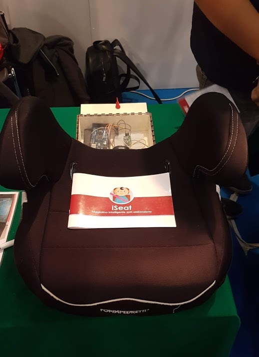
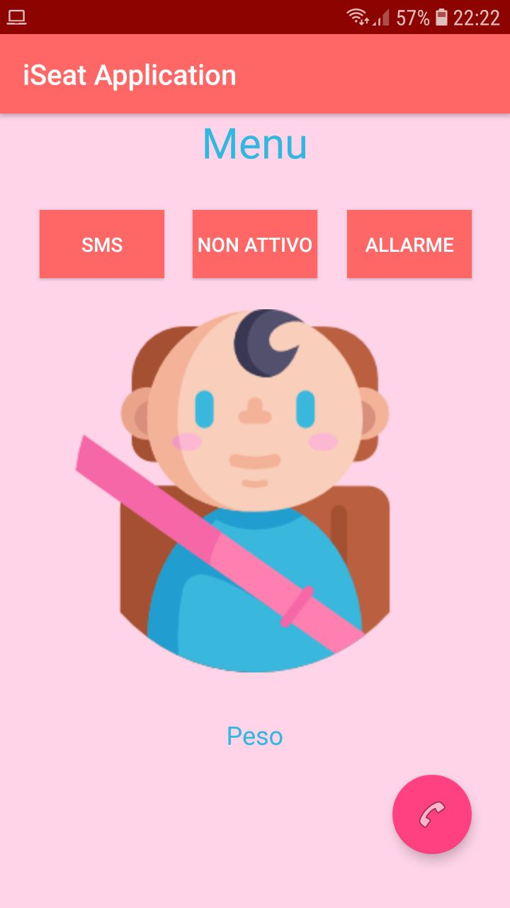

# iSeat 👶

iSeat is an intelligent anti-abandonment booster seat and one of my first application I ever made that I began in 2017. with this app I started to have a soft spot for mobile programming and even if it is not perfect (it is still an alpha project) I learnt a lot and it made me live some amazing experiences.

### Project idea

By following the news, I asked myself how important and fundamental the creation of a new safety system for children transported in vehicles was. I decided to develop a child booster seat designed to prevent the little one from being unintentionally left inside the car by the parent, causing, in many cases, the death of him.

### Components

For the components I used an Arduino mega, a load cell, bluetooth model and a power supply. I asked a friend of mine to help me with this activity and he made the project box (with plexiglass and wood).

### User Journey

When the app starts, the user needs to enter the Mac address of the bluetooth module to be able to connect with the Arduino.  the first time the user opens the app, he will be required to enter a number by pressing the appropriate button, this number will be saved in a sqlite database. After that, he can connect to the device with bluetooth and this connection will be used to confirm or not the presence of the parent in the car.

In fact if the parent were to move away from the car, the bluetooth signal would drop and at this point the app will verify through the last message received from the arduino, the presence of the child and if so it would start the alarm systems and send the emergency message.

### Fun fact :bug:

Here I would like to thanks my math teacher of my high school who was amazed by this project and asked me to partecipate with her robotic's team at the **Maker Faire Rome 2018** edition

### :books: Technologies I used 
- Bluetooth adapter 
- Sqlite database
- Notifications 
- Google Maps (removed in this version)
